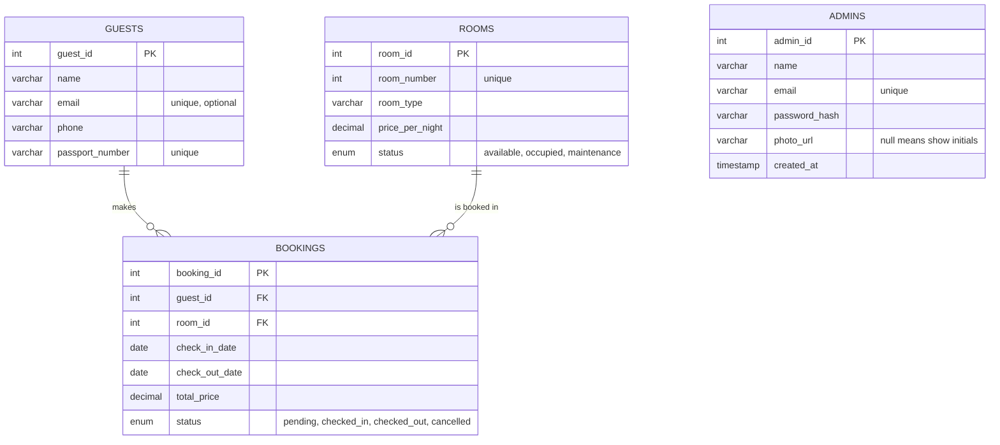

# Hotel Room Booking Management System

A web app for running a small hotel's front desk: register guests, manage rooms, take bookings, check guests in and out, and see how much money the bookings bring in.

It has a React admin dashboard, a Node.js/Express REST API, and a MySQL database. Only logged-in admins can see or change hotel data.

## Contents

- [Features](#features)
- [Tech stack](#tech-stack)
- [Project structure](#project-structure)
- [Getting started](#getting-started)
- [Environment variables](#environment-variables)
- [Scripts](#scripts)
- [How the app behaves](#how-the-app-behaves)
- [API reference](#api-reference)
- [Database](#database)
- [Frontend overview](#frontend-overview)

## Features

**Admin accounts**

- Log in with email and password.
- First-run setup: when no admin exists yet, the login page offers to create the first admin.
- Logged-in admins can add more admins from the avatar menu.
- Option to do a profile photo upload available. Initials are shown when there is no photo.

**Dashboard**

- Cards for total guests, available rooms, active bookings and occupancy.
- The five most recent bookings.

**Guests, rooms and bookings**

- Add, edit and delete for each.
- Rooms page tabs: All, Available, Occupied, Maintenance. The filtering is done by the API.
- Bookings page tabs: All, Pending, Checked in, Checked out, Cancelled.
- The booking form fills in the total price from the room's nightly rate and the number of nights. The total can still be edited.
- Rooms under maintenance can't be picked for a new booking.
- A room's status follows its bookings. Checking a guest in marks the room occupied; checking out frees it.

**Revenue**

- Monthly bar chart for a chosen year, split into earned, in-house and expected money.
- Revenue by room type.
- Value lost to cancellations.

**API documentation**

- Interactive Swagger docs at `/api-docs`.

## Tech stack

| Layer | Technology |
| --- | --- |
| Frontend | React 19, Vite 8, Tailwind CSS 4, React Router 7, Recharts 3 (charts), lucide-react (icons) |
| Backend | Node.js, Express 5, mysql2, jsonwebtoken (login tokens), bcryptjs (password hashing), multer (photo uploads), dotenv, cors |
| API docs | swagger-jsdoc, swagger-ui-express |
| Database | MySQL 8 |
| Dev tools | nodemon (restarts the backend when files change) |

## Project structure

```
hotelbookingsystem/
├── backend/
│   ├── app.js                    # entry point: middleware, routes, Swagger, starts the server
│   ├── config/
│   │   └── database.js           # MySQL connection pool (reads .env)
│   ├── routes/                   # URL paths + Swagger comments
│   │   ├── authRoutes.js
│   │   ├── guestRoutes.js
│   │   ├── roomRoutes.js
│   │   ├── bookingRoutes.js
│   │   └── reportRoutes.js
│   ├── controllers/              # validation and responses for each route
│   │   ├── authController.js
│   │   ├── guestController.js
│   │   ├── roomController.js
│   │   ├── bookingController.js
│   │   └── reportController.js
│   ├── models/                   # SQL queries
│   │   ├── adminModel.js
│   │   ├── guestModel.js
│   │   ├── roomModel.js
│   │   ├── bookingModel.js
│   │   └── reportModel.js
│   ├── middleware/
│   │   ├── authMiddleware.js     # checks the login token
│   │   └── uploadMiddleware.js   # saves profile photos
│   ├── swagger/
│   │   └── swagger.js            # Swagger configuration
│   ├── database/
│   │   ├── schema.sql            # creates hotel_db and the guests, rooms, bookings and admins tables
│   │   ├── seed.sql              # sample data            
│   │   └── Dump.sql              # table-structure export from MySQL Workbench
│   ├── uploads/                  # created automatically for profile photos (git-ignored)
│   ├── .env.example
│   └── package.json
│
└── frontend/
    ├── index.html
    ├── vite.config.js            # dev server + proxy to the backend
    ├── public/
    │   ├── favicon.svg           # dashboard favicon 
    │   └── favicon-login.svg     # login page favicon 
    ├── src/
    │   ├── main.jsx              # starts React, wraps the app in its providers
    │   ├── App.jsx               # page routes and the logged-in check
    │   ├── index.css             # Tailwind + colour tokens
    │   ├── api/                  # one file per backend resource
    │   ├── assets/
    │   │   └── login-hotel.jpg   # login background page photo
    │   ├── components/
    │   │   ├── forms/            # add/edit popups for guests, rooms, bookings
    │   │   ├── layout/           # sidebar, top bar, avatar menu
    │   │   └── ui/               # buttons, tables, badges, tabs, modals
    │   ├── context/              # AuthContext (login state), ToastContext (pop-up messages)
    │   ├── hooks/                # useApiData, usePageMeta
    │   ├── pages/                # Login, Dashboard, Guests, Rooms, Bookings, Revenue
    │   └── utils/
    │       └── format.js         # money, dates, initials, status labels
    └── package.json
```

## Getting started

### Prerequisites

- **Node.js 20.19+ or 22.12+.** Vite 8 needs one of these versions. Check yours with `node -v`.
- **npm**, which comes with Node.js.
- **MySQL 8**, plus either the `mysql` command-line client or MySQL Workbench.

### 1. Get the code

```bash
git clone <your-repository-url>
cd hotelbookingsystem
```

### 2. Set up the database

Open a MySQL client from the project root:

```bash
mysql -u root -p
```

Then run the scripts in this order:

```sql
SOURCE backend/database/schema.sql;
SOURCE backend/database/seed.sql;
SOURCE backend/database/admins.sql;
```

`seed.sql` is optional; it adds 5 guests, 5 rooms and 5 bookings to try the app with. In MySQL Workbench, open each file with **File → Open SQL Script** and run it instead.

The backend should connect with its own MySQL user rather than `root`. To create one:

```sql
CREATE USER 'HotelManager'@'localhost' IDENTIFIED BY 'choose-a-password';
GRANT ALL PRIVILEGES ON hotel_db.* TO 'HotelManager'@'localhost';
FLUSH PRIVILEGES;
```

### 3. Start the backend

```bash
cd backend
npm install
```

Create your `.env` file from the example:

```bash
# macOS / Linux / Git Bash
cp .env.example .env

# Windows PowerShell
Copy-Item .env.example .env
```

Open `.env` and fill in your database details and a `JWT_SECRET`. One way to generate a secret:

```bash
node -e "console.log(require('crypto').randomBytes(32).toString('hex'))"
```

Start the server:

```bash
npm run dev
```

You should see:

```
Hotel Booking API running on http://localhost:5000
Swagger docs available at http://localhost:5000/api-docs
```

### 4. Start the frontend

In a second terminal:

```bash
cd frontend
npm install
npm run dev
```

Open the address Vite prints, usually <http://localhost:5173>. If that port is busy, Vite picks the next free one, such as 5174.

### 5. Create the first admin

On the first visit, the login page shows **Create the first admin**. Enter a name, email and password (at least 5 characters). You are logged in straight away and can add more admins from the avatar menu in the top-right corner.

## Environment variables

### Backend (`backend/.env`)

| Variable | Required | Example | Purpose |
| --- | --- | --- | --- |
| `PORT` | No | `5000` | Port the API listens on. Defaults to 5000. |
| `DB_HOST` | Yes | `localhost` | MySQL server address |
| `DB_PORT` | No | `3306` | MySQL port. Defaults to 3306. |
| `DB_USER` | Yes | `HotelManager` | MySQL user |
| `DB_PASSWORD` | Yes | | MySQL password |
| `DB_NAME` | Yes | `hotel_db` | Database name |
| `JWT_SECRET` | Yes | long random text | Signs login tokens. The server refuses to start without it. |

### Frontend (`frontend/.env`, optional)

| Variable | Purpose |
| --- | --- |
| `VITE_API_URL` | Only needed when the built frontend is hosted separately from the API, e.g. `https://api.example.com`. Leave it unset during development. |

## Scripts

| Folder | Command | What it does |
| --- | --- | --- |
| `backend` | `npm run dev` | Starts the API and restarts it whenever a file changes |
| `backend` | `npm start` | Starts the API without auto-restart |
| `frontend` | `npm run dev` | Starts the development server |
| `frontend` | `npm run build` | Builds the production files into `frontend/dist` |
| `frontend` | `npm run preview` | Serves the production build locally to check it |

## How the app behaves

These are the rules the code follows. They matter when reading the dashboard and revenue numbers.

**Dashboard numbers**

- **Active bookings** counts bookings that are `pending` or `checked_in`.
- **Occupancy** is occupied rooms divided by all rooms, rounded to a whole percentage. Rooms under maintenance count in the total.

**Room status follows bookings**

- When a booking becomes `checked_in`, its room becomes `occupied`.
- A checked-in booking can be checked out, cancelled, moved to another room, or deleted. When that happens, its old room goes back to `available`, but only if the room is still `occupied`.
- A room someone has set to `maintenance` is never changed automatically.

**Revenue page**

- Bookings are grouped by the month of their **check-in date**.
- **Earned** is checked-out bookings, **In house** is checked-in bookings, and **Expected** is pending bookings.
- Cancelled bookings are left out of the totals and shown separately as lost to cancellations.

**Deleting**

- Deleting a guest or a room also deletes all of their bookings. The database does this through `ON DELETE CASCADE`.
- The app asks for confirmation before any delete.

**Admin accounts**

- Emails are stored in lowercase, so logging in works regardless of capitals.
- Passwords are hashed with bcrypt and never stored as plain text.
- A login lasts one day, then the admin is sent back to the login page.

## API reference

**Base URL:** `http://localhost:5000`

**Authentication:** every route except the public ones below needs this header:

```
Authorization: Bearer <token>
```

Get a token from `POST /api/auth/login`.

**Response format**

- Errors come back as `{ "message": "..." }`. Some server errors also include an `error` field with the underlying database message.
- Dates are returned as `YYYY-MM-DD` strings.
- `price_per_night` and `total_price` are returned as strings such as `"90.00"`, which is how mysql2 returns MySQL `DECIMAL` values.

### Auth

| Method | Endpoint | Login needed | Description |
| --- | --- | --- | --- |
| GET | `/api/auth/status` | No | `{ hasAdmins }`: whether any admin account exists |
| POST | `/api/auth/signup` | Only after the first admin | Create an admin. The first admin also receives a token. |
| POST | `/api/auth/login` | No | Returns `{ token, admin }` |
| GET | `/api/auth/me` | Yes | The logged-in admin |
| POST | `/api/auth/me/photo` | Yes | Upload a profile photo: `multipart/form-data`, field `photo`, JPG/PNG/WEBP/GIF, max 2 MB |
| DELETE | `/api/auth/me/photo` | Yes | Remove the profile photo |

```json
POST /api/auth/login
{ "email": "admin@hotel.com", "password": "password123" }
```

### Guests

| Method | Endpoint | Description |
| --- | --- | --- |
| GET | `/api/guests` | All guests |
| GET | `/api/guests/:id` | One guest |
| POST | `/api/guests` | Create a guest. Returns `{ message, guest_id }`. |
| PUT | `/api/guests/:id` | Update a guest. Send every field. |
| DELETE | `/api/guests/:id` | Delete a guest and their bookings |

```json
POST /api/guests
{ "name": "Ashwin Patel", "email": "ashwin.patel@email.com", "phone": "57654321", "passport_number": "P1234567" }
```

Rules:

- `name`, `phone` and `passport_number` are required.
- `email` is optional, but must be unique when given. Send `null` rather than an empty string when there is none.
- `passport_number` must be unique.

### Rooms

| Method | Endpoint | Description |
| --- | --- | --- |
| GET | `/api/rooms` | All rooms, ordered by room number |
| GET | `/api/rooms?status=occupied` | Only rooms with that status: `available`, `occupied` or `maintenance` |
| GET | `/api/rooms/:id` | One room |
| POST | `/api/rooms` | Create a room. Returns `{ message, room_id }`. |
| PUT | `/api/rooms/:id` | Update a room. Send every field. |
| DELETE | `/api/rooms/:id` | Delete a room and its bookings |

```json
POST /api/rooms
{ "room_number": 101, "room_type": "Single", "price_per_night": 60, "status": "available" }
```

Rules:

- `room_number`, `room_type` and `price_per_night` are required.
- `price_per_night` must be greater than 0.
- `room_number` must be unique.
- `status` is optional and defaults to `available`.

### Bookings

| Method | Endpoint | Description |
| --- | --- | --- |
| GET | `/api/bookings` | All bookings |
| GET | `/api/bookings/details` | All bookings with `guest_name` and `room_number` added |
| GET | `/api/bookings/:id` | One booking |
| GET | `/api/bookings/:id/details` | One booking with `guest_name` and `room_number` |
| POST | `/api/bookings` | Create a booking. Returns the booking with details. |
| PUT | `/api/bookings/:id` | Update a booking. Every field, including `status`, is required. |
| DELETE | `/api/bookings/:id` | Delete a booking |

```json
POST /api/bookings
{
  "guest_id": 1,
  "room_id": 2,
  "check_in_date": "2026-10-01",
  "check_out_date": "2026-10-04",
  "total_price": 270,
  "status": "pending"
}
```

Rules:

- `guest_id`, `room_id`, `check_in_date`, `check_out_date` and `total_price` are required.
- `check_out_date` must be after `check_in_date`.
- `status` must be one of `pending`, `checked_in`, `checked_out` or `cancelled`. It defaults to `pending` on create.
- `guest_id` and `room_id` must belong to an existing guest and room.

### Reports

| Method | Endpoint | Description |
| --- | --- | --- |
| GET | `/api/reports/summary` | Dashboard numbers |
| GET | `/api/reports/revenue?year=2026` | Revenue for one year. Defaults to the current year. |

`/api/reports/summary` returns:

```json
{
  "total_guests": 5,
  "total_rooms": 5,
  "available_rooms": 3,
  "occupied_rooms": 1,
  "maintenance_rooms": 1,
  "active_bookings": 3,
  "occupancy_rate": 20
}
```

`/api/reports/revenue` returns the following fields:

| Field | Contents |
| --- | --- |
| `year` | The year requested |
| `years` | Years to choose from: the current year plus every year that has bookings |
| `totals` | `earned`, `in_house`, `expected`, `cancelled`, `bookings`, `total` |
| `monthly` | Always 12 entries, each with `month` (`YYYY-MM`), `earned`, `in_house`, `expected`, `cancelled`, `bookings` |
| `by_room_type` | One entry per room type, with `room_type`, `revenue`, `bookings`. Cancelled bookings are excluded; highest revenue first. |

### Other routes

| Method | Endpoint | Description |
| --- | --- | --- |
| GET | `/` | Confirms the API is running |
| GET | `/api/health` | Returns `{ status: "ok" }`. Only confirms the server is up; it does not check the database. |
| GET | `/api-docs` | Swagger UI |
| GET | `/uploads/admins/<file>` | Uploaded profile photos |

### Trying the API in Swagger or Postman

1. Open <http://localhost:5000/api-docs>.
2. Run `POST /api/auth/login` and copy the `token` from the response.
3. Click **Authorize**, paste the token, and confirm.
4. Every other route now works from the docs page.

In Postman, choose **Auth → Bearer Token** and paste the same token.

## Database



- **Bookings** link a guest to a room. Deleting either one deletes its bookings.
- **Admins** are separate from hotel data. They are the accounts that log in to the dashboard.

## Frontend overview

- **Login state:** `src/context/AuthContext.jsx` keeps track of the logged-in admin. The token is saved in the browser's `localStorage`, so refreshing the page keeps you logged in.
- **API calls:** every request goes through `src/api/client.js`. It adds the token to the request and turns errors into readable messages. If the backend rejects the token, the admin is logged out automatically.
- **Loading data:** each page uses `src/hooks/useApiData.js`, so pages show loading, error and "Try again" states consistently.
- **Pop-up messages:** confirmations such as "Guest added" come from `src/context/ToastContext.jsx`. They stay visible after a form closes or the page changes.
- **Page routes:**
  - `/login`
  - `/` for the dashboard
  - `/guests`
  - `/rooms`, which remembers the selected tab in the address, e.g. `/rooms?status=occupied`
  - `/bookings`, which remembers its tab the same way
  - `/revenue`
- **Loading speed:** the Revenue page, and its charting library, is only downloaded when someone opens it. This keeps the first load faster.

## Demo-Video Link
[https://drive.google.com/drive/folders/1T4OKFvPB0LEanGOfyG0WbQB8eA-NdY10](url)


